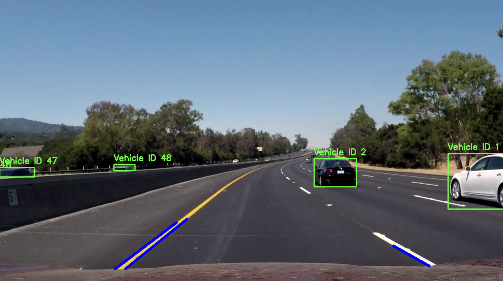

# Autonomous Vehicle System using Deep Learning 🚗

## Overview

This project implements a basic Autonomous Vehicle System using Deep Learning and Computer Vision techniques.

The system can:

* Detect vehicles using YOLOv8
* Track vehicles with unique IDs
* Detect road lanes
* Process autonomous driving videos in real time

---

# Features

* YOLOv8 Vehicle Detection
* Vehicle Tracking
* Lane Detection
* Real-Time Video Processing
* Autonomous Driving Visualization

---

# Technologies Used

* Python
* OpenCV
* YOLOv8
* Ultralytics
* NumPy

---

# Project Structure

```bash
Autonomous-Vehicle-System/
│
├── datasets/
│   ├── challenge.mp4
│   ├── harder_challenge_video.mp4
│   ├── challenge_video.mp4
│   └── road.jpg
│
├── outputs/
│   └── final_output.mp4
│
├── screenshots/
│   └── output.png
│
├── final_autonomous_system.py
├── yolo_detection.py
├── vehicle_tracking.py
├── lane_detection.py
├── requirements.txt
├── README.md
└── yolov8n.pt
```

---

# Installation

## Clone Repository

```bash
git clone https://github.com/tiyahans/Autonomous-Vehicle-System.git
```

---

## Open Project Folder

```bash
cd Autonomous-Vehicle-System
```

---

## Install Dependencies

```bash
pip install -r requirements.txt
```

---

# Run Project

```bash
python final_autonomous_system.py
```

---

# Output

The processed output video will be saved inside:

```bash
outputs/final_output.mp4
```

---

# Project Output Screenshot



---

# Future Improvements

* Traffic Sign Detection
* Pedestrian Detection
* Accident Prediction
* Speed Estimation
* Autonomous Steering Control

---

# Author

## Tiya Hans

GitHub:
https://github.com/tiyahans

---

# Repository Link

https://github.com/tiyahans/Autonomous-Vehicle-System
